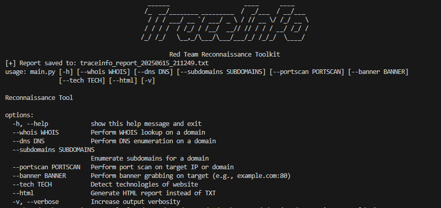
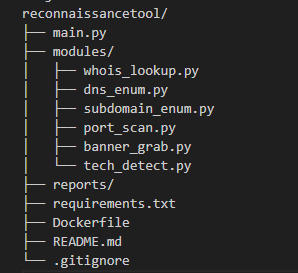

# 🕵️ Reconnaissance Tool

A lightweight, modular CLI-based recon tool named Trace Info  developed for the **Offensive Summer Internship Task**. It automates passive and active reconnaissance tasks useful for red team operations and penetration testing.
## 🖥️ CLI Interface 

Here is what the tool looks like when run from the terminal:



---

## 🔍 Features

### Passive Recon
- WHOIS lookup
- DNS enumeration (A, MX, TXT, NS)
- Subdomain discovery (via APIs: crt.sh, AlienVault OTX)

### Active Recon
- Port scanning (Nmap wrapper or raw sockets)
- Banner grabbing
- Technology detection (WhatWeb/Wappalyzer integration)

### Reporting
- `.txt` or `.html` summary reports
- Timestamps and resolved IP info

---

## 📁 Project Structure




## ⚙️ Installation

### 1. Clone the Repository

```bash
git clone https://github.com/javeria-786/ReconnaissanceTool.git
cd recon-tool

# WHOIS
python main.py --whois example.com -v[for verbosity level]

# DNS Records
python main.py --dns example.com -v[for verbosity level]

# Subdomains
python main.py --subdomains example.com -v[for verbosity level]

# Run all modules
python main.py --whois example.com --dns example.com --subdomains example.com -v[for verbosity level]

# for report 
just add --html or --txt at end of command 
